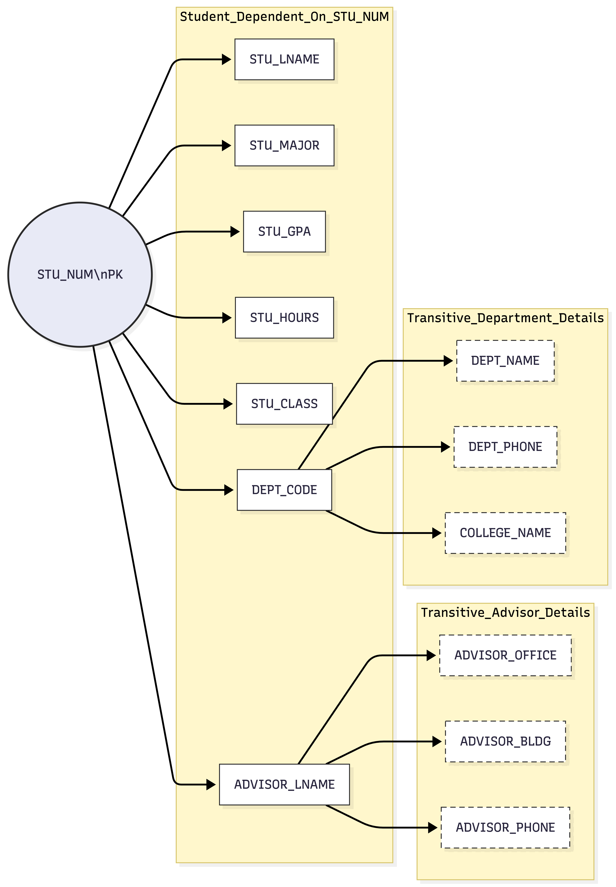
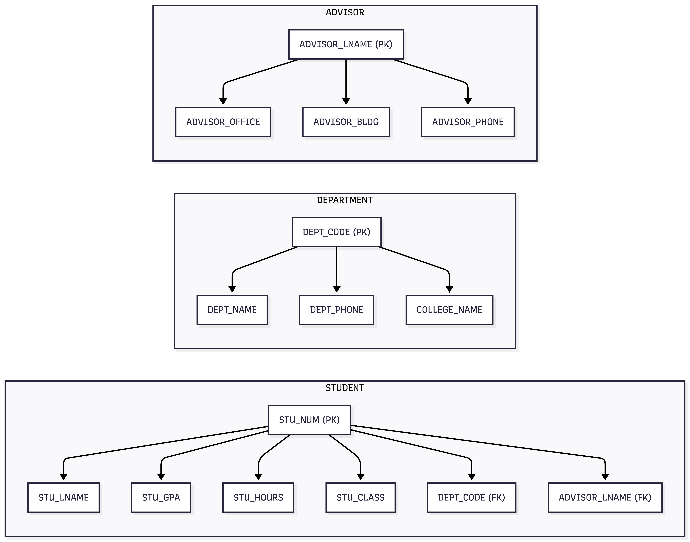
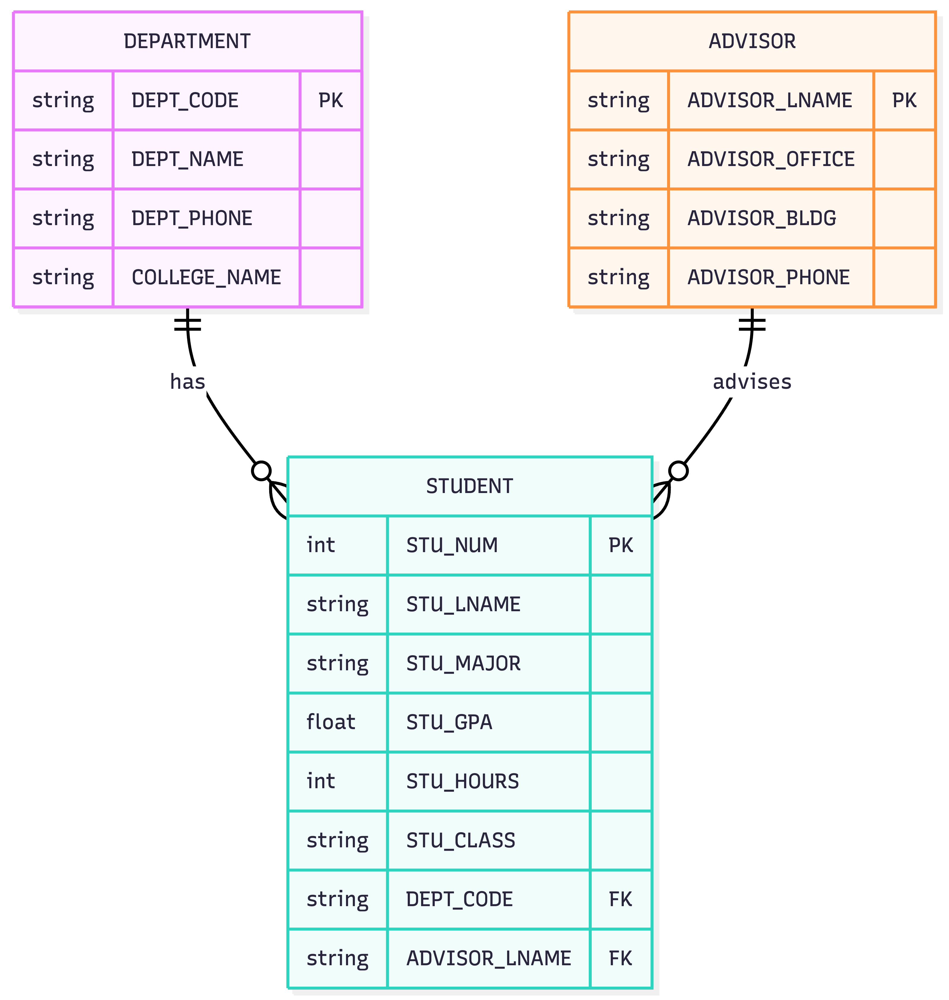

## (a) Unnormalized Schema and Dependency Analysis

### 1. Original Relational Schema
The original unnormalized STUDENT table is defined as follows:

STUDENT(
STU_NUM,
STU_LNAME,
STU_MAJOR,
DEPT_CODE,
DEPT_NAME,
DEPT_PHONE,
COLLEGE_NAME,
ADVISOR_LNAME,
ADVISOR_OFFICE,
ADVISOR_BLDG,
ADVISOR_PHONE,
STU_GPA,
STU_HOURS,
STU_CLASS
)

Primary Key: STU_NUM

### 2. Assumptions
1. STU_NUM uniquely identifies each student.  
2. Each student belongs to exactly one department.  
3. DEPT_CODE uniquely identifies a department.  
4. Department name, phone number, and college name depend on DEPT_CODE.  
5. Each student is assigned to one advisor.  
6. ADVISOR_LNAME uniquely identifies an advisor.  
7. Advisor office, building, and phone number depend on ADVISOR_LNAME.  
8. Although STU_HOURS and STU_CLASS are related, STU_CLASS is not functionally dependent on STU_HOURS because it is determined by ranges of credit hours rather than a one-to-one mapping.

### 3. Functional Dependencies

#### 3.1 Dependencies determined by the primary key
STU_NUM → STU_LNAME, STU_MAJOR, DEPT_CODE, ADVISOR_LNAME, STU_GPA, STU_HOURS, STU_CLASS

#### 3.2 Department-related dependencies
DEPT_CODE → DEPT_NAME, DEPT_PHONE, COLLEGE_NAME

#### 3.3 Advisor-related dependencies
ADVISOR_LNAME → ADVISOR_OFFICE, ADVISOR_BLDG, ADVISOR_PHONE

### 4. Transitive Dependencies
The following transitive dependencies exist in the STUDENT table:

- STU_NUM → DEPT_NAME, DEPT_PHONE, COLLEGE_NAME (via DEPT_CODE)  
- STU_NUM → ADVISOR_OFFICE, ADVISOR_BLDG, ADVISOR_PHONE (via ADVISOR_LNAME)

These transitive dependencies indicate that the STUDENT table is not in Third Normal Form (3NF).

### 5. Dependency Diagram
A dependency diagram illustrating the functional dependencies and transitive dependencies of the STUDENT table has been created and saved as `dependency_diagram.png`.

---

## (b) Normalization to 3NF (or justified 2NF)

### 1. Normalization Goal
The original STUDENT table contains transitive dependencies through the attributes DEPT_CODE and ADVISOR_LNAME. In order to satisfy the requirements of Third Normal Form (3NF), the table is decomposed into multiple relations so that all non-key attributes depend only on the primary key and not on other non-key attributes.

### 2. Decomposition into 3NF Relations

STUDENT(
STU_NUM,
STU_LNAME,
STU_MAJOR,
STU_GPA,
STU_HOURS,
STU_CLASS,
DEPT_CODE,
ADVISOR_LNAME
)

Primary Key: STU_NUM  

Foreign Keys:  
- DEPT_CODE references DEPARTMENT(DEPT_CODE)  
- ADVISOR_LNAME references ADVISOR(ADVISOR_LNAME)

DEPARTMENT(
DEPT_CODE,
DEPT_NAME,
DEPT_PHONE,
COLLEGE_NAME
)

Primary Key: DEPT_CODE  
Foreign Keys: None

ADVISOR(
ADVISOR_LNAME,
ADVISOR_OFFICE,
ADVISOR_BLDG,
ADVISOR_PHONE
)

Primary Key: ADVISOR_LNAME  
Foreign Keys: None

### 3. Justification of 3NF
In the decomposed schema, the STUDENT relation contains only attributes that are directly dependent on the primary key STU_NUM. Department-related attributes are stored in the DEPARTMENT relation and depend only on DEPT_CODE. Advisor-related attributes are stored in the ADVISOR relation and depend only on ADVISOR_LNAME. As a result, all transitive dependencies present in the original STUDENT table are removed, and the schema satisfies Third Normal Form (3NF).

### 4. Practical Consideration
Although STU_HOURS and STU_CLASS are related, STU_CLASS is not considered functionally dependent on STU_HOURS because student classification is determined by ranges of completed credit hours rather than a strict one-to-one mapping. Therefore, STU_CLASS is kept as an attribute of the STUDENT relation for practical reasons.

---

## (c) Crow’s Foot ERD

The Crow’s Foot ERD based on the final normalized design has been created and saved as `student_erd.png`.

